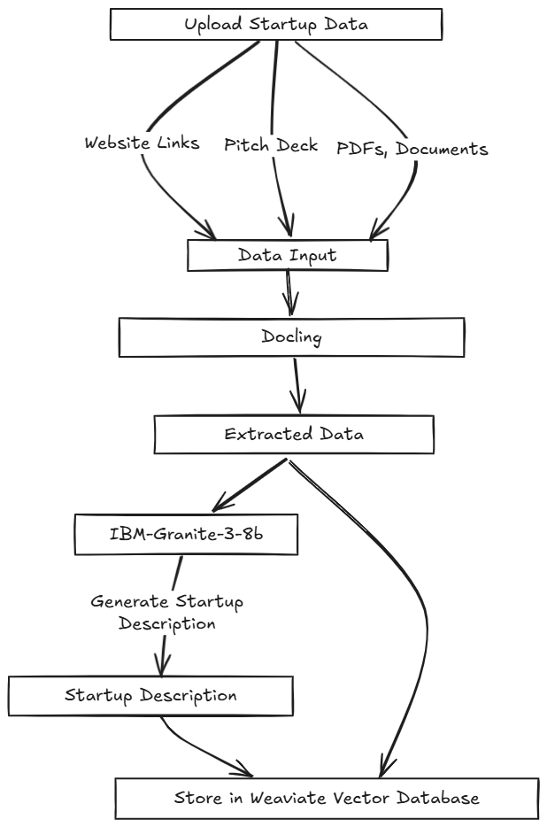
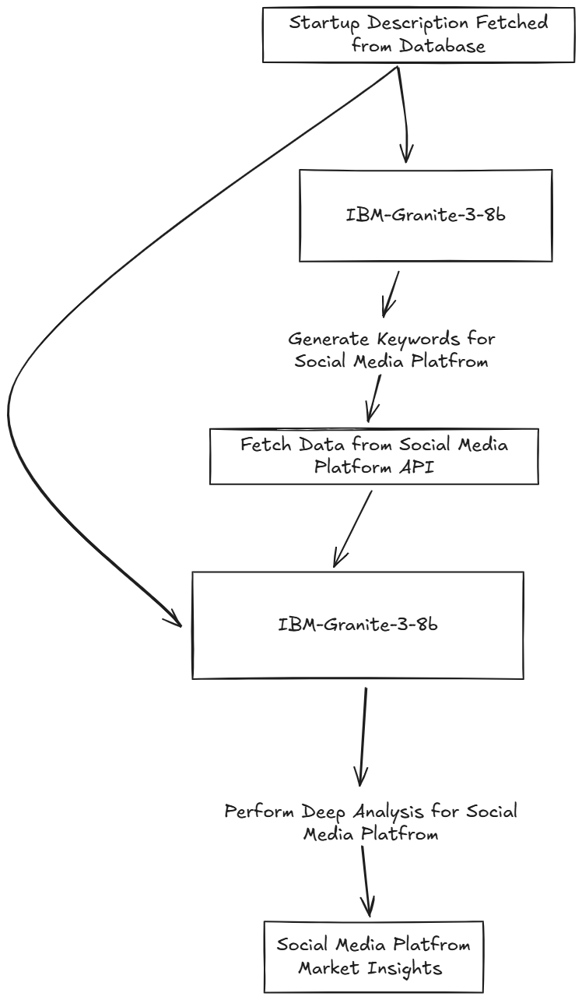
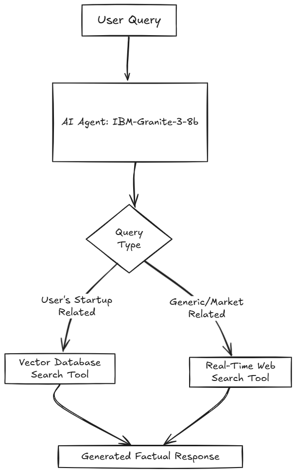

# REACH: Helping Founders Reach the Right Audience at the Right Time

REACH is an AI-powered platform designed to streamline market research for startup founders. By analyzing real-time trends across social media platforms like Instagram, Twitter, and Reddit, REACH provides tailored insights into customer needs, competitor activities, and emerging opportunities. This enables founders to develop products that resonate with their target audience and launch effective marketing campaigns.

## Features

- **Automated Market Analysis**: Upload your startup's materials (e.g., website links, pitch decks) to receive instant analysis and insights.
- **Real-Time Social Media Monitoring**: Stay updated with the latest trends and discussions relevant to your industry.
- **AI-Powered Marketing Strategies**: Receive customized marketing recommendations based on data-driven insights.
- **Interactive AI Agent**: Engage with a Retrieval-Augmented Generation (RAG) based AI agent for deeper exploration of your data and market landscape.

## Live Demo

Experience REACH in action: [https://reach-ai-app.streamlit.app/](https://reach-ai-app.streamlit.app/)

## How to Use

1. **Upload Materials**: Provide your startup's website link(s) and/or pitch deck.
2. **Data Processing**: REACH analyzes your input to understand your business context.
3. **Insight Generation**: Receive detailed reports on customer needs, competitor activities, and market opportunities.
4. **Strategy Development**: Utilize AI-generated marketing strategies tailored to your target audience.
5. **Interactive Exploration**: Chat with the AI agent to delve deeper into specific insights or trends.

## Local Setup Instructions

To run REACH locally, follow these steps:

1. **Clone the Repository**:
   ```bash
   git clone https://github.com/Ayesha-Imr/REACH.git
   cd REACH
   ```

2. **Install Dependencies**:
   Ensure you have Python installed. It's recommended to use a virtual environment:
   ```bash
   python3 -m venv env
   source env/bin/activate  # On Windows, use `env\Scripts\activate`
   pip install -r requirements.txt
   ```

3. **Set Up Environment Variables**:
   Create a `secrets.toml` file in the .streamlit folder and add necessary configurations:
   ```env
     [apify]
    apify_token="<your_apify_token>"
    
    [weaviate]
    WEAVIATE_API_KEY="<your_weaviate_token>"
    WEAVIATE_URL="<your_weaviate_url>"
    COHERE_API_KEY="<your_cohere_token>"
    
    [reddit]
    REDDIT_CLIENT_ID="<your_reddit_id>"
    REDDIT_CLIENT_SECRET="<your_reddit_secret>"
    REDDIT_USER_AGENT="<your_user_agent>"
    REDDIT_USERNAME="<your_reddit_username>"
    REDDIT_PASSWORD="<your_reddit_password>"
    
    [ibm]
    IBM_WATSON_KEY="<your_ibm_token>"
    IBM_PROJECT_ID="<your_ibm_id>"
    
    [tavily]
    TAVILY_API_KEY="<your_tavily_token>"
   ```

4. **Run the Application**:
   Start the Streamlit app:
   ```bash
   streamlit run Main.py
   ```

5. **Access the Application**:
   Open your browser and navigate to `http://localhost:8501` to use REACH locally.

## Flow Diagrams

To better understand REACH's internal processes, refer to the following flow diagrams:

1. **User Input Processing**:

   

   *Description*: This diagram illustrates how REACH processes user-provided materials to generate a comprehensive startup profile.


2. **Social Media Data Analysis**:

   

   *Description*: This diagram showcases the steps REACH takes to collect and analyze data from each social media platform, providing detailed market insights


3. **AI Agent Interaction**:

   

   *Description*: This diagram depicts the interaction between the user and the tool-calling AI agent for in-depth data exploration.

---

For any questions or support, please open an issue in this repository. 
